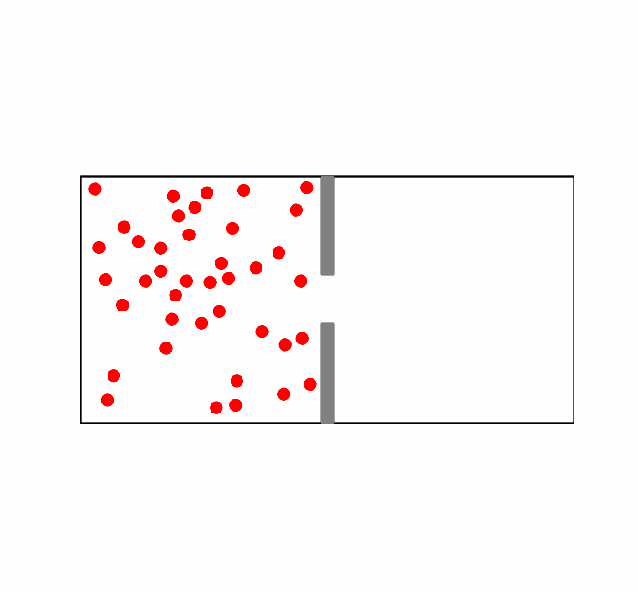
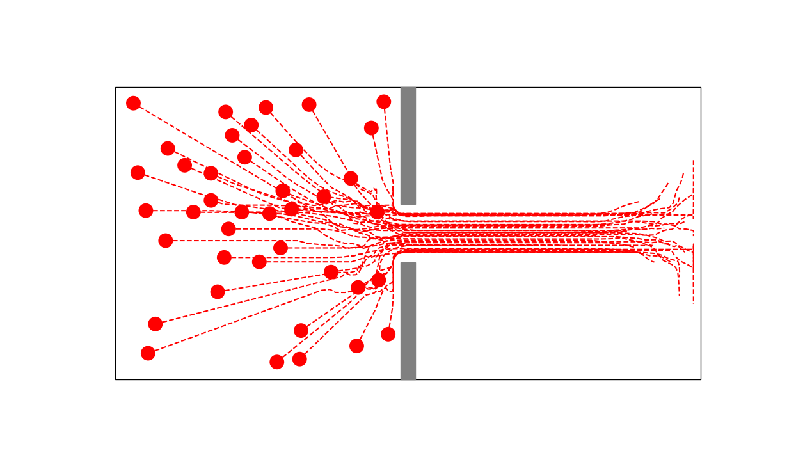

# Crowd motion simulation

The principle of Bertrand Maury and Juliette Venel's contact crowd movement model is to assume that each individual in a crowd has a trajectory that he would like to follow if he were alone. Being in a crowd, he deviates from this trajectory when he is about to collide with someone. 

Beyond the mathematical considerations of the model, it is very faithful to the behaviours observed in very dense crowds and allows to model well emergency evacuation situations. It can also be relevant in physical modelling, to illustrate the mechanics of granular materials for example. 

The model is detailed on the paper available [here](https://hal.science/hal-00350815).

**Example of a simulation with 20 people and radius 15 :**

    </a>
    </a>

## Setup of the code
This computational code is written in Python. The projection of optimisation part is made with [CVXPY](https://www.cvxpy.org/), other computation are made with [Numpy](https://numpy.org/) to reduce the most as possible the computation time. Plots are made with [Matplotlib](https://matplotlib.org/).
All dependencies are available on [environment.yml](environment.yml).

To setup the environment you can follow these steps :
1. Clone the repository : `git clone git@github.com:sachabinder/crowd-motion-simulation.git`
2. Be sure to be on the repo folder and clone the [conda](https://www.anaconda.com/products/distribution) environment : `conda env create -f environment.yml`
3. Activate the conda env : `conda activate crowd_env`
4. Run the simulation : `python main.py`

## Environment
You can fix several parameters for the simulation. They are listed in the table below.
| Variable | Description | Default value |
|-----------------------|---------------------------------------------------------------------------------------------------------------------------------------|------------------|
| zone_width | Width of the moving zone | 800 |
| zone_height | Height of the moving zone | 400 |
| exit_center_width | Width position of the exit center | zone_width/2 |
| exit_center_height | Height position of the exit center | zone_width/2 |
| exit_radius_width | Length of exit lane | 10 |
| exit_radius_height | Radius of the exit | 40 |
| people_radius | Number of people | 20 |
| people_radius | People radius body shape | 15 |
| people_speed | Spontaneous speed norm of people | 6 |
| time_step_number | Number of discrete time step | 40 |
| max_time_step | Simulation final time | 120 |
| random_initial_position | Say if the people initial position should be random (from a pkl file if not) | True |
| save_solution | Save the solution on a pkl file | False |
| file_name | Name of the solution file | data.pkl |

